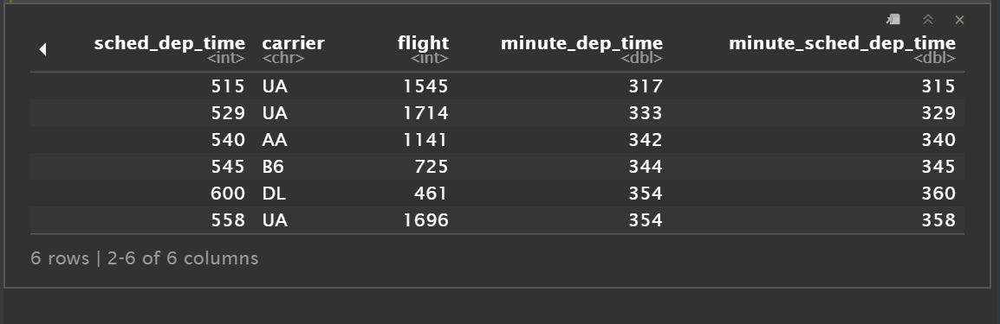

```{r setup, include=FALSE}
knitr::opts_chunk$set(echo = TRUE)
library(nycflights13)
library(ggplot2)
library(dplyr)
library(lubridate)
library(RColorBrewer)

```
```{r}

# flights
# ?flights
# flights[,5:10]
# colnames(flights)
# str(flights)

```


##1)

```{r}

colSums(is.na(flights))
```

This shows that 8255 flights have missing dep time. some other missing variables are arr_time, dep_delay, arr_delay, air_time, tailnum. a lot of these values must be na because the flight got cancelled. When the flight didn't take off, there wouldn't be any airtime values or delay either.

##2) (figure 1)
```{r}
flight_small <- select(flights,
                       dep_time,
                       sched_dep_time, 
                       carrier,
                       flight
) %>% 
mutate(
       minute_dep_time = ((dep_time %/% 100 *60) + (dep_time %% 100)),
       minute_sched_dep_time = ((sched_dep_time %/% 100 *60) + (sched_dep_time %% 100))
       
)
```

The table won't knit because it is too large, I have included a screenshot of it at the end of this document

###3)

```{r}
flights %>%
  mutate(day_of_year = yday(time_hour)) %>%
  group_by(day_of_year) %>%
  summarise(
    num_cancelled = sum(is.na(dep_time)| is.na(arr_time)),
    total_flights = n(),
    avg_delay = mean(na.omit(dep_delay)),
    prop_cancelled = num_cancelled/total_flights
  ) %>%
  ggplot (mapping = aes (y = prop_cancelled, x = day_of_year, color = avg_delay ))+
  geom_point(size = 1)+
  scale_color_gradient(low = "#295777", high = "#E74C3C")+
  ggtitle ("Cancelled flights")+
  ylab("Cancelled flights as a percentage")+
  xlab("Day")

  
flights %>%
  mutate(day_of_year = yday(time_hour)) %>%
  group_by(day_of_year) %>%
  summarise(
    num_cancelled = sum(is.na(dep_time)| is.na(arr_time)),
    total_flights = n(),
    avg_delay = mean(na.omit(dep_delay)),
    prop_cancelled = num_cancelled/total_flights
  ) %>%
  ggplot (mapping = aes (y = prop_cancelled, x = avg_delay, color = day_of_year))+
  geom_point(size = 1)+
  scale_color_gradient(high = "#DEEDCF", low = "#0A2F51")+
  ggtitle ("Cancelled flights")+
  ylab("Cancelled flights as a percentage")+
  xlab("Average Delay")


```

From first glance, it seems like the flights cancelled goes up seasonally. Flights could be cancelled because of weather, lack of tickets sold, engine failure a whole vareity of possible reasons. However, the reason for the seasonallity could be mor towards weather.

It seems like when the delay is higher, the chances of a cancelled flight could be more probable. It seems like there is a relation in the sense that towards the end of the year, there is more delay and more cancelled flights. 


